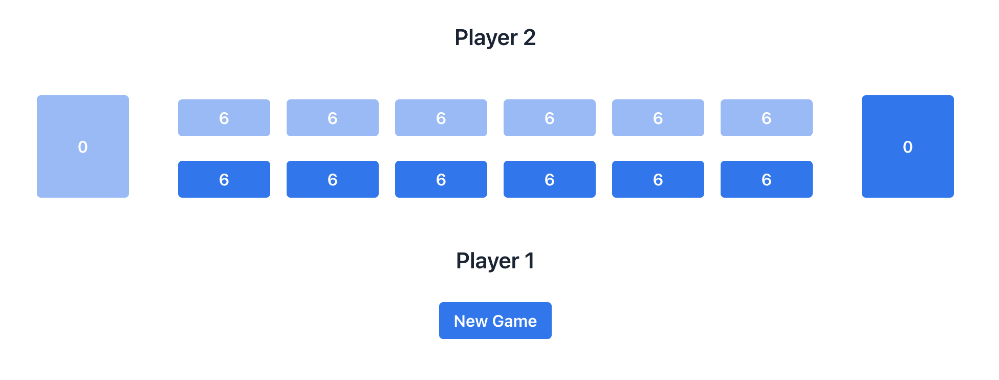
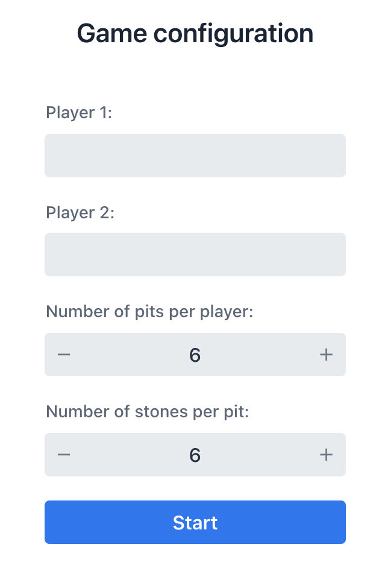

Kalah, also called Kalaha or Mancala, is a game in the mancala family imported in the United States by William Julius Champion, Jr. in 1940.  This game is sometimes also called "Kalahari", possibly by false etymology from the Kalahari desert in Namibia.  
The game provides a Kalah board and a number of stones or counters. The board has 6 small pits, called houses, on each side; and a big pit, called a kalaha, at each end. The objective of the game is to capture more stones than one's opponent - [Wikipedia](https://en.wikipedia.org/wiki/Mancala)

## Game Configuration

The following attributes must be entered prior to starting the game.
* `Player 1`: Name of first player (mandatory)
* `Player 2`: Name of second player (mandatory)
* `Number of pits per player`: Number of pits to be added to each player's side (mandatory, range[1-10])
* `Number of stones per pit`: Number of stones to be added to each pit (mandatory, range[1-10])

## Board Setup (Default)

* `2 Players`
* `12 pits`: 6 on each player's side
* `72 stones`: 6 stones in each pit at the start of the game
* `2 kalahas`: 1 on each player's side, empty at the start of the game

## Game Play
The player who begins with the first move picks up all the stones in anyone of their own six pits, and sows the stones on to the right, one in each of the following pits, including their own Kalaha. No stones are put in the opponents' Kalaha. If the player's last stone lands in their own Kalaha, he gets another turn. This can be repeated several times before it's the other player's turn.

## Capturing Stones
During the game the pits are emptied on both sides. Always when the last stone lands in an own empty pit, the player captures their own stone and all stones in the opposite pit (the other players' pit) and puts them in their own Kalaha.

## The Game Ends
The game is over as soon as one of the sides run out of stones. The player who still has stones in their pits keeps them and puts them in their Kalaha. Winner of the game is the player who has the most stones in their Kalaha.

# Getting Started

Please see [GETTING-STARTED.md](GETTING-STARTED.md)

## Author

**Gokhan Daglioglu**